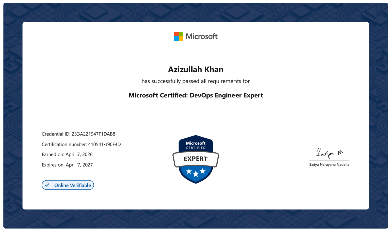

# AZ-400: Designing and Implementing Microsoft DevOps Solutions — Complete Study Notes

### **I passed the exam using these notes. Now sharing them with the community.**

 

 

> **9,000+ lines of exam-focused notes** · **8 complete modules** · **6,000+ real exam dump questions**  
> Everything you need to pass AZ-400 on your first attempt — for free.

---

## Why These Notes Are Different

Most study guides are either too shallow or too long to revise quickly before the exam. These notes were written to be **both deep and fast to review**:

- **Deep Conceptual Explanations** — every major topic has a "why it works this way" breakdown, not just bullet points
- **Exam-Critical Callouts** — sections tagged `EXAM CRITICAL` or `DEEP CONCEPTUAL EXPLANATION` highlight what Microsoft actually tests
- **ASCII Architecture Diagrams** — visual representations of pipeline topology, deployment flows, and component relationships built into the markdown
- **Must-Know Numbers** — limits, thresholds, and numeric values Microsoft loves to test
- **Past Exam Scenario Banks** — real exam scenarios with recommended answers and reasoning, included in every module
- **Quick-Reference Checklists** — YAML syntax, pipeline triggers, RBAC roles, package versioning strategies at a glance

---

## Table of Contents

- [What's Inside](#whats-inside)
- [Exam Domain Breakdown](#exam-domain-breakdown)
- [Module 1: Git for Enterprise DevOps](#module-1-git-for-enterprise-devops)
- [Module 2: Implement CI with Azure Pipelines and GitHub Actions](#module-2-implement-ci-with-azure-pipelines-and-github-actions)
- [Module 3: Design and Implement a Release Strategy](#module-3-design-and-implement-a-release-strategy)
- [Module 4: Implement Secure Continuous Deployment](#module-4-implement-secure-continuous-deployment)
- [Module 5: Manage Infrastructure as Code](#module-5-manage-infrastructure-as-code)
- [Module 6: Design and Implement a Dependency Management Strategy](#module-6-design-and-implement-a-dependency-management-strategy)
- [Module 7: Implement Continuous Feedback](#module-7-implement-continuous-feedback)
- [Module 8: Implement Security and Validate Code Bases for Compliance](#module-8-implement-security-and-validate-code-bases-for-compliance)
- [Dump Questions — Real Exam Questions](#dump-questions--real-exam-questions)
- [How to Use These Notes](#how-to-use-these-notes)
- [Exam at a Glance](#exam-at-a-glance)
- [Contributing](#contributing)

---

## What's Inside

| File | Description |
|------|-------------|
| [01-git-for-enterprise-devops.md](01-git-for-enterprise-devops.md) | Git strategies, branching workflows, Azure Repos, PR workflows, inner source, technical debt |
| [02-implement-ci-azure-pipelines-github-actions.md](02-implement-ci-azure-pipelines-github-actions.md) | Azure Pipelines, agents, YAML deep dive, GitHub Actions, container builds |
| [03-design-implement-release-strategy.md](03-design-implement-release-strategy.md) | Release pipelines, approval gates, environment provisioning, deployment templates |
| [04-implement-secure-continuous-deployment.md](04-implement-secure-continuous-deployment.md) | Blue-green, canary, feature flags, A/B testing, secrets and configuration management |
| [05-manage-infrastructure-as-code.md](05-manage-infrastructure-as-code.md) | ARM templates, Bicep, Azure Automation, Desired State Configuration, IaC patterns |
| [06-design-implement-dependency-management-strategy.md](06-design-implement-dependency-management-strategy.md) | Azure Artifacts, NuGet, npm, versioning strategies, GitHub Packages |
| [07-implement-continuous-feedback.md](07-implement-continuous-feedback.md) | Azure Monitor, Application Insights, dashboards, alerting, blameless retrospectives |
| [08-implement-security-validate-code-bases-compliance.md](08-implement-security-validate-code-bases-compliance.md) | DevSecOps, SCA, SAST/DAST, Defender for DevOps, compliance scanning |
| [practise_exam_questions/](practise_exam_questions/) | 21 real exam dump PDFs, 6,000+ questions (2025–2026) |

---

## Exam Domain Breakdown

The AZ-400 exam tests five functional domains. Here's the official weight and which note file(s) cover it:

| Domain | Weight | Note File(s) |
|--------|--------|--------------|
| Configure processes and communications | **10–15%** | [01-git-for-enterprise-devops.md](01-git-for-enterprise-devops.md) |
| Design and implement source control | **15–20%** | [01-git-for-enterprise-devops.md](01-git-for-enterprise-devops.md) |
| Design and implement build and release pipelines | **40–45%** | [02](02-implement-ci-azure-pipelines-github-actions.md) · [03](03-design-implement-release-strategy.md) · [04](04-implement-secure-continuous-deployment.md) · [05](05-manage-infrastructure-as-code.md) · [06](06-design-implement-dependency-management-strategy.md) |
| Develop a security and compliance plan | **10–15%** | [08-implement-security-validate-code-bases-compliance.md](08-implement-security-validate-code-bases-compliance.md) |
| Implement an instrumentation strategy | **10–15%** | [07-implement-continuous-feedback.md](07-implement-continuous-feedback.md) |

> **Tip**: Build and release pipelines alone cover 40–45% of the exam. Modules 02–06 are your highest-ROI reading.

---

## Module 1: Git for Enterprise DevOps

**File:** [01-git-for-enterprise-devops.md](01-git-for-enterprise-devops.md)

### Topics Covered

- **Introduction to DevOps** — DevOps principles, the CALMS framework, value stream mapping, DevOps transformation journey
- **Agile Planning** — Azure Boards work item types, GitHub Projects setup, sprint planning, backlog management, Kanban boards
- **Branch Strategies & Workflows** — Trunk-based development vs GitFlow vs GitHub Flow — when each applies, exam decision criteria
- **Pull Requests & Code Review in Azure Repos** — PR policies, required reviewers, branch protection rules, auto-complete, merge strategies
- **Git Hooks** — Pre-commit, pre-push, post-merge hooks — client-side vs server-side hooks, use cases (EXAM CRITICAL)
- **Inner Source & Fork Workflow** — Inner source model for enterprise, fork-and-PR workflow, upstream sync patterns
- **Manage & Configure Repositories** — Repo settings, large file storage (Git LFS), `.gitignore`, repo permissions, cross-repo linking
- **Technical Debt & Code Quality** — Static analysis tools, code metrics, SonarCloud/SonarQube integration, quality gates
- **Additional Exam Topics** — Cherry-pick vs merge vs rebase, shallow clones, sparse checkout, submodules
- **Past Exam Scenario Bank** — Exam scenarios with correct answers and reasoning
- **Quick Reference: Exam Checklist** — All must-know commands, policies, and decision criteria at a glance

---

## Module 2: Implement CI with Azure Pipelines and GitHub Actions

**File:** [02-implement-ci-azure-pipelines-github-actions.md](02-implement-ci-azure-pipelines-github-actions.md)

### Topics Covered

- **Explore Azure Pipelines** — Classic vs YAML pipelines, pipeline components (stages, jobs, steps, tasks), pipeline hierarchy
- **Manage Agents and Pools** — Microsoft-hosted vs self-hosted agents, agent pools, agent capabilities, demands, parallel jobs
- **Pipelines and Concurrency** — Parallelism limits, concurrency slots, pipeline queuing behavior, free vs paid tiers (EXAM CRITICAL)
- **Design and Implement a Pipeline Strategy** — Multi-stage pipelines, environment-based promotion, template reuse patterns
- **Integrate with Azure Pipelines — YAML Deep Dive** — Triggers (CI, PR, scheduled), variables, variable groups, environments, approvals, checks, expressions, conditions
- **Introduction to GitHub Actions** — Workflow anatomy, events, jobs, runners, action marketplace, reusable workflows
- **Continuous Integration with GitHub Actions** — Branch protection with status checks, matrix builds, artifact publishing, caching
- **Container Build Strategy** — Docker build tasks, multi-stage Dockerfiles, image tagging, Azure Container Registry integration
- **Additional Exam Topics** — Pipeline decorators, service connections, service principals, managed identities in pipelines
- **Past Exam Scenario Bank** — Common exam scenarios: agent selection, trigger configuration, YAML syntax
- **Quick Reference: Exam Checklist** — YAML trigger syntax, agent pool comparison, key pipeline YAML properties

---

## Module 3: Design and Implement a Release Strategy

**File:** [03-design-implement-release-strategy.md](03-design-implement-release-strategy.md)

### Topics Covered

- **Create a Release Pipeline** — Classic release pipelines vs multi-stage YAML, artifacts, artifact sources, release triggers
- **Release Strategy Recommendations** — When to use manual vs automated approvals, deployment rings, progressive rollout
- **Configure and Provision Environments** — Azure Pipelines environments, Kubernetes resource targets, VM resource targets, environment history and auditing
- **Manage and Modularize Tasks and Templates** — Task groups (classic), YAML templates (step, job, stage templates), template inheritance, template parameters
- **Automate Inspection of Health** — Pre-deployment and post-deployment gates — Azure Monitor alerts, REST API queries, Work Item Query gates, Service Bus checks (EXAM CRITICAL)
- **Additional Exam Topics** — Deployment strategies in YAML (runOnce, rolling, canary), environment approvals and checks, timeout configuration
- **Past Exam Scenario Bank** — Gate configuration, approval workflows, multi-stage promotion scenarios
- **Quick Reference: Exam Checklist** — Deployment strategy syntax, gate types, environment RBAC

---

## Module 4: Implement Secure Continuous Deployment

**File:** [04-implement-secure-continuous-deployment.md](04-implement-secure-continuous-deployment.md)

### Topics Covered

- **Introduction to Deployment Patterns** — Deployment strategy comparison: rolling, blue-green, canary, shadow — risk vs complexity tradeoffs
- **Blue-Green Deployment and Feature Toggles** — Slot swapping in Azure App Service, traffic routing, swap warm-up, feature flag frameworks (LaunchDarkly, Azure App Configuration)
- **Canary Releases and Dark Launching** — Weighted traffic routing, canary analysis metrics, automatic rollback triggers
- **A/B Testing and Progressive Exposure Deployment** — Hypothesis-driven development, experiment instrumentation, exposure management
- **Integrate with Identity Management Systems** — Service connections, workload identity federation, managed identity for pipelines, Azure Key Vault integration (EXAM CRITICAL)
- **Manage Application Configuration Data** — Azure App Configuration, Key Vault references, configuration versioning, feature management
- **Additional Exam Topics** — Deployment slots, slot settings vs app settings, connection string slot-stickiness
- **Past Exam Scenario Bank** — Deployment pattern selection, secrets rotation without redeployment, progressive rollout configurations
- **Quick Reference: Exam Checklist** — Deployment pattern comparison table, Key Vault access models, App Configuration tiers

---

## Module 5: Manage Infrastructure as Code

**File:** [05-manage-infrastructure-as-code.md](05-manage-infrastructure-as-code.md)

### Topics Covered

- **Explore Infrastructure as Code and Configuration Management** — Imperative vs declarative IaC, idempotency, IaC in CI/CD pipelines, drift detection
- **Create Azure Resources using ARM Templates** — Template structure, parameters, variables, functions, `dependsOn`, linked templates, template specs
- **Create Azure Resources Using Azure CLI** — CLI scripting in pipelines, `az deployment group create`, idempotency patterns, what-if operations
- **Explore Azure Automation with DevOps** — Azure Automation accounts, runbooks, update management, hybrid workers, DSC pull server
- **Implement Desired State Configuration (DSC)** — DSC configurations, resources, push vs pull mode, LCM settings, Azure Automation DSC (EXAM CRITICAL)
- **Implement Bicep** — Bicep vs ARM comparison, modules, outputs, parameter files, Bicep linter, migration from ARM
- **Additional Exam Topics** — Terraform on Azure (state backend, resource groups, provider config), Ansible for Azure, Pulumi
- **Past Exam Scenario Bank** — IaC tool selection, DSC vs Custom Script Extension, Bicep module design
- **Quick Reference Checklist** — ARM template functions reference, Bicep syntax cheat sheet, DSC configuration structure

---

## Module 6: Design and Implement a Dependency Management Strategy

**File:** [06-design-implement-dependency-management-strategy.md](06-design-implement-dependency-management-strategy.md)

### Topics Covered

- **Explore Package Dependencies** — Dependency types, transitive dependencies, dependency graphs, lock files, dependency confusion attacks
- **Understand Package Management** — NuGet, npm, Maven, Python (pip/twine) — ecosystem comparison, package structure
- **Migrate, Consolidate, and Secure Artifacts** — Azure Artifacts feeds, upstream sources, feed visibility (org vs project-scoped), package promotion between feeds (EXAM CRITICAL)
- **Implement a Versioning Strategy** — Semantic versioning (SemVer), CalVer, pre-release versions, package immutability, deprecation vs unlisting
- **Introduction to GitHub Packages** — GitHub Packages vs Azure Artifacts, supported package types, authentication, visibility settings
- **Additional Exam Topics** — Universal packages, symbol packages, NuGet credential provider, pipeline feed authentication
- **Past Exam Scenario Bank** — Feed configuration, upstream source order, versioning strategy selection
- **Quick Reference Checklist** — Azure Artifacts tier limits, versioning format comparison, feed permission roles

---

## Module 7: Implement Continuous Feedback

**File:** [07-implement-continuous-feedback.md](07-implement-continuous-feedback.md)

### Topics Covered

- **Implement Tools to Track Usage and Flow** — Azure Monitor, Application Insights instrumentation (SDK vs codeless), custom events, telemetry sampling
- **Develop Monitor and Status Dashboards** — Azure dashboards, Azure Monitor Workbooks, Application Insights dashboards, pipeline analytics, Power BI integration
- **Share Knowledge Within Teams** — Azure DevOps wikis, team dashboards, sprint retrospectives, inner loop vs outer loop feedback
- **Design Processes to Automate Application Analytics** — Smart detection, log-based alerts, metric alerts, action groups, alert processing rules
- **Manage Alerts, Blameless Retrospectives, and a Just Culture** — On-call management, incident response, postmortem culture, SLI/SLO/SLA definitions (EXAM CRITICAL)
- **Additional Exam Topics** — Continuous monitoring in release pipelines, Azure Monitor gates, Application Insights availability tests, distributed tracing
- **Past Exam Scenario Bank** — Alert rule configuration, dashboard setup, instrumentation strategy selection
- **Quick Reference Checklist** — Application Insights SDK languages, alert rule components, KQL query patterns for DevOps

---

## Module 8: Implement Security and Validate Code Bases for Compliance

**File:** [08-implement-security-validate-code-bases-compliance.md](08-implement-security-validate-code-bases-compliance.md)

### Topics Covered

- **Introduction to Secure DevOps** — Shift-left security, DevSecOps principles, threat modelling in pipelines, security as code
- **Implement Open-Source Software** — OSS governance, approved package lists, license compliance, dependency confusion mitigation
- **Software Composition Analysis** — SCA tools (OWASP Dependency-Check, WhiteSource/Mend), CVE scanning, vulnerability severity thresholds, pipeline integration (EXAM CRITICAL)
- **Security Monitoring and Governance** — Microsoft Defender for DevOps, GitHub Advanced Security (GHAS), code scanning, secret scanning, Dependabot alerts
- **Additional Exam Topics** — Static Application Security Testing (SAST), Dynamic Application Security Testing (DAST), container image scanning, compliance policies in pipelines, Azure Policy integration
- **Past Exam Scenario Bank** — Tool selection for secret scanning, SCA pipeline integration, Defender for DevOps setup
- **Quick Reference Checklist** — Security tool comparison table, GHAS feature matrix, Defender for DevOps supported platforms

---

## Dump Questions — Real Exam Questions

**Folder:** [practise_exam_questions/](practise_exam_questions/)

> These are **real AZ-400 exam questions** that have appeared in the actual Microsoft certification exam, aggregated from across the internet. All files are dated 2025–2026 and reflect the current live exam version.

21 dump PDFs from multiple sources — covering every exam domain, question type (multiple choice, drag & drop, hotspot), and scenario pattern that Microsoft uses.

> **6,000+ practice questions** covering every exam domain.

---

## How to Use These Notes

### 4-Week Study Plan

**Week 1 — Skim the Notes, Then Start the Course (Days 1–2: Notes · Days 3–7: Course + Labs)**

Spend the first 1–2 days doing a fast read of the notes — don't go deep, just build a mental map of what exists:

1. [02-implement-ci-azure-pipelines-github-actions.md](02-implement-ci-azure-pipelines-github-actions.md) — CI pipelines cover the heaviest exam domain; skim this first
2. [03-design-implement-release-strategy.md](03-design-implement-release-strategy.md)
3. [04-implement-secure-continuous-deployment.md](04-implement-secure-continuous-deployment.md)
4. [05-manage-infrastructure-as-code.md](05-manage-infrastructure-as-code.md)
5. [06-design-implement-dependency-management-strategy.md](06-design-implement-dependency-management-strategy.md)
6. [01-git-for-enterprise-devops.md](01-git-for-enterprise-devops.md)
7. [08-implement-security-validate-code-bases-compliance.md](08-implement-security-validate-code-bases-compliance.md)
8. [07-implement-continuous-feedback.md](07-implement-continuous-feedback.md)

From day 3, jump straight into the course. Choose one:

- **Udemy (Recommended):** Search for *"AZ-400 Designing and Implementing Microsoft DevOps Solutions"* — pick the highest-rated course with recent reviews; live pipeline demos lock in the YAML syntax and agent configuration that notes alone won't
- **Microsoft Learn YouTube Channel:** Microsoft's official [Azure DevOps playlist](https://www.youtube.com/@MicrosoftAzure) — free, authoritative, and updated whenever the exam changes

**Weeks 2 & 3 — Course + Labs**

Continue and complete the course. As you cover each topic, go back to the relevant note file and read that section properly — the combination of video and notes is far more effective than either alone.

Actually build things: create an Azure DevOps organisation on a free trial, run a multi-stage YAML pipeline, publish a package to Azure Artifacts, and deploy with blue-green slots. Hands-on experience cements the scenarios Microsoft tests.

**Week 4 — Dumps + Final Revision**

Work through the real exam questions in [practise_exam_questions/](practise_exam_questions/):

- Do 60–80 questions per session in timed conditions
- For every wrong answer, go back to the relevant module in the notes and re-read it
- Don't just memorise answers — understand *why* each correct answer is correct and why the distractors are wrong
- Aim to cover as many dump files as possible; repeated questions across files are a strong signal they will appear on the real exam

Final revision before exam day:

1. Re-read all sections tagged `EXAM CRITICAL` across every module
2. Review all **Quick Reference Checklists** and **Past Exam Scenario Banks** at the end of each file
3. Do one final timed mock exam (50 questions, 120 minutes) from the dumps
4. The day before: light revision only — scenario banks and quick-reference checklists, nothing new

### Tips for Using These Notes

- Search for `EXAM CRITICAL` to jump straight to the highest-yield content
- Search for `DEEP CONCEPTUAL EXPLANATION` when you want to understand the *why* behind a feature
- Every module ends with a **Past Exam Scenario Bank** — work through these before touching the dumps
- The **Quick Reference Checklist** in each module is ideal for last-day revision
- Scenario sections mirror the case-study format Microsoft uses in the actual exam

---

## Exam at a Glance

| Property | Detail |
|----------|--------|
| Exam Code | AZ-400 |
| Full Name | Designing and Implementing Microsoft DevOps Solutions |
| Questions | ~40–60 |
| Duration | 120 minutes |
| Passing Score | 700 / 1000 |
| Format | Multiple choice, drag & drop, hotspot, case studies |
| Renewal | Annual free online assessment |
| Prerequisite | None required (recommended: AZ-104 or AZ-204) |

---

## Contributing

Found a mistake, a stale fact, or a missing topic? Pull requests are welcome.

- Fix typos or outdated information — open a PR directly
- Add newly released dump files to [practise_exam_questions/](practise_exam_questions/)

If these notes helped you pass, **please star the repo** — it helps others find it when they search for AZ-400 study materials.

---

## Search Keywords

> *For search engines — these are the topics this repo covers.*

`AZ-400` `AZ-400 study notes` `AZ-400 exam prep` `AZ-400 dumps` `AZ-400 free dumps` `AZ-400 practice questions` `AZ-400 cheat sheet` `AZ-400 pass first attempt` `AZ-400 notes` `AZ-400 2025` `AZ-400 2026` `Azure DevOps exam` `Azure DevOps study guide` `Azure DevOps certification` `DevOps Engineer Expert certification` `DevOps Engineer Expert exam notes` `Microsoft AZ-400` `Designing and Implementing Microsoft DevOps Solutions` `Azure DevOps Engineer Expert` `Azure Pipelines study notes` `Azure Pipelines exam questions` `GitHub Actions AZ-400` `Azure Artifacts exam` `Azure DevOps YAML pipelines` `IaC AZ-400` `Bicep ARM templates exam` `FSLogix AZ-400` `DevSecOps certification` `SCA exam questions` `Defender for DevOps exam` `AZ-400 brain dumps` `AZ-400 exam dumps 2025` `AZ-400 exam dumps 2026` `free AZ-400 study material` `AZ-400 blue-green canary deployment` `AZ-400 release pipeline` `AZ-400 infrastructure as code` `AZ-400 dependency management` `AZ-400 continuous feedback` `AZ-400 Application Insights`

---

**Good luck on your exam.**  
*These notes got me through it — they can get you through it too.*

